# Madrasah Management System (MMS)

A full-stack web application for managing a Madrasah (Islamic educational institution). Built with React on the frontend and a custom PHP REST API on the backend, it covers everything from student enrollment and fee collection to exam results, attendance, and a public-facing website.

---

## Table of Contents

- [Features](#features)
- [Tech Stack](#tech-stack)
- [Project Structure](#project-structure)
- [Prerequisites](#prerequisites)
- [Installation & Setup](#installation--setup)
- [Environment Configuration](#environment-configuration)
- [Database Setup](#database-setup)
- [Running the Application](#running-the-application)
- [User Roles & Access](#user-roles--access)
- [API Overview](#api-overview)
- [Security](#security)
- [Deployment](#deployment)
- [Diagrams](#diagrams)
  - [ER Diagram — Core](#er-diagram--core)
  - [ER Diagram — Finance](#er-diagram--finance)
  - [ER Diagram — Academic](#er-diagram--academic)
  - [ER Diagram — Website & Content](#er-diagram--website--content)
  - [Data Flow — User Authentication](#data-flow--user-authentication)
  - [Data Flow — Fee Collection](#data-flow--fee-collection)
  - [Data Flow — Exam & Results](#data-flow--exam--results)
  - [Data Flow — Student Promotion](#data-flow--student-promotion)
  - [Data Flow — Attendance](#data-flow--attendance)
  - [System Architecture Overview](#system-architecture-overview)
  - [Key Relationships Summary](#key-relationships-summary)
  - [Database Views Reference](#database-views-reference)
  - [Stored Procedures Reference](#stored-procedures-reference)
- [Troubleshooting](#troubleshooting)

---

## Features

### Public Website
- Dynamic homepage with hero carousel, gallery, notices, and committee members
- Public notice board with published announcements
- Class and exam routine viewer
- Student result checker (by student ID)
- Student ID verification
- Homepage teacher showcase
- Site features section
- Privacy policy, terms, and sitemap pages

### Admin Panel
| Module | Description |
|---|---|
| Dashboard | Overview stats — students, fees, salaries, attendance |
| Student Management | Add, edit, archive, restore students with photo upload |
| Teacher Management | Manage teacher profiles, subjects, salaries |
| Class Management | Create classes, assign sections and class teachers |
| Subject Management | Assign subjects per class with teacher mapping |
| Academic Sessions | Create sessions, activate, lock, and snapshot data |
| Student Promotion | Promote or demote students between classes/sessions |
| Fee Management | Generate monthly fees, collect payments, track dues |
| Salary Management | Generate and pay teacher salaries |
| Exam Management | Create exams, enter marks, publish results |
| Attendance | Daily attendance tracking with reports and stats |
| Holiday Manager | Define holidays to exclude from attendance |
| Notices | Create, approve, and publish notices |
| Routines | Manage class and exam timetables |
| Gallery | Upload and manage photo gallery |
| Transactions | Income/expense ledger with monthly reports |
| Receipts | Fee payment receipts with print support |
| Salary Receipts | Teacher salary payment receipts |
| Site Settings | Logo, site name, colors, contact info |
| User Management | Assign roles to registered users |

### Teacher Portal
- Dashboard with class overview
- View assigned class students
- Enter exam marks
- View class routine
- Manage attendance for assigned class
- View notices

### Student Portal
- Personal dashboard
- Profile viewer
- Exam results with grades and ranking
- Fee status and payment history
- Class and exam routine
- Notice board

---

## Tech Stack

### Frontend
| Technology | Version | Purpose |
|---|---|---|
| React | 19 | UI framework |
| React Router DOM | 7 | Client-side routing |
| Vite | 8 | Build tool and dev server |
| Axios | 1.14 | HTTP client |
| React Hook Form | 7 | Form management |
| React Icons | 5 | Icon library |
| SweetAlert2 | 11 | Alert dialogs |
| html2canvas | 1.4 | Receipt/card screenshot |

### Backend
| Technology | Purpose |
|---|---|
| PHP 8+ | REST API server |
| MySQL / MariaDB | Database |
| PDO | Database abstraction |
| JWT (custom) | Authentication tokens |
| BCrypt | Password hashing |

### Server Requirements
- Apache with `mod_rewrite` enabled
- PHP 8.0+
- MySQL 5.7+ or MariaDB 10.3+
- XAMPP / WAMP / Laragon (local) or any Apache host

---

## Project Structure

```
madrasah-mms/
├── backend/                    # PHP REST API
│   ├── config/
│   │   ├── app.php             # App base URL & upload paths
│   │   ├── database.php        # PDO database connection
│   │   └── jwt.php             # JWT encode/decode
│   ├── controllers/            # One controller per resource
│   │   ├── AuthController.php
│   │   ├── StudentController.php
│   │   ├── TeacherController.php
│   │   ├── FeeController.php
│   │   ├── ExamController.php
│   │   ├── ResultController.php
│   │   ├── AttendanceController.php
│   │   ├── SalaryController.php
│   │   ├── NoticeController.php
│   │   ├── RoutineController.php
│   │   ├── SessionController.php
│   │   └── ... (20+ controllers)
│   ├── helpers/
│   │   ├── FileUpload.php      # Secure image upload handler
│   │   ├── IdGenerator.php     # Auto-increment ID generator
│   │   ├── Response.php        # Standardized JSON responses
│   │   ├── Security.php        # Rate limiting, validation, logging
│   │   └── ...
│   ├── middleware/
│   │   └── Auth.php            # JWT authentication middleware
│   ├── routes/
│   │   └── api.php             # All route definitions
│   ├── uploads/                # Private uploads (students, teachers)
│   ├── logs/                   # Security event logs
│   ├── .htaccess               # Apache rewrite + security rules
│   ├── index.php               # API entry point
│   └── setup.php               # Initial admin account setup
│
├── public/
│   └── uploads/                # Public uploads (gallery, committee, logo)
│       ├── gallery/
│       ├── committee/
│       ├── homepage_gallery/
│       ├── logo/
│       └── .htaccess           # Blocks script execution in uploads
│
├── src/                        # React frontend
│   ├── components/             # Reusable UI components
│   │   ├── Modal.jsx
│   │   ├── Table.jsx
│   │   ├── Pagination.jsx
│   │   ├── PaymentReceipt.jsx
│   │   ├── AdmitCard.jsx
│   │   └── ...
│   ├── context/                # React context providers
│   │   ├── AuthContext.jsx
│   │   ├── StudentContext.jsx
│   │   ├── FeeContext.jsx
│   │   ├── SiteSettingsContext.jsx
│   │   └── ...
│   ├── layouts/
│   │   ├── MainLayout.jsx      # Public pages layout
│   │   └── DashboardLayout.jsx # Admin/teacher/student layout
│   ├── pages/
│   │   ├── admin/              # All admin panel pages
│   │   ├── teacher/            # Teacher portal pages
│   │   ├── student/            # Student portal pages
│   │   └── (public pages)      # Homepage, login, result check, etc.
│   ├── routes/
│   │   ├── ProtectedRoute.jsx  # Role-based route guard
│   │   └── AccountantRoute.jsx # Accountant access guard
│   ├── services/
│   │   └── api.js              # Centralized API client
│   └── utils/
│       ├── dateFormat.js
│       ├── compressImage.js
│       └── swal.js
│
├── .env                        # Environment variables
├── index.html                  # Vite HTML entry
├── vite.config.js
├── package.json
└── madrasah_mms.sql            # Full database schema + seed data
```

---

## Prerequisites

Before you begin, make sure you have:

- **Node.js** v18+ — [nodejs.org](https://nodejs.org)
- **npm** v9+ (comes with Node.js)
- **XAMPP** (or WAMP / Laragon) — [apachefriends.org](https://www.apachefriends.org)
  - Apache with `mod_rewrite` enabled
  - PHP 8.0+
  - MySQL 5.7+
- **Git** — [git-scm.com](https://git-scm.com)

---

## Installation & Setup

### Step 1 — Clone the repository

```bash
git clone https://github.com/yourusername/madrasah-mms.git
cd madrasah-mms
```

Or place the project folder inside your web server root:
- XAMPP: `C:/xampp/htdocs/madrasah/`
- WAMP: `C:/wamp64/www/madrasah/`
- Laragon: `C:/laragon/www/madrasah/`

### Step 2 — Install frontend dependencies

```bash
npm install
```

### Step 3 — Configure environment variables

Copy the example env file and edit it:

```bash
cp .env.example .env
```

Open `.env` and update:

```env
VITE_API_URL=http://localhost/madrasah/backend
```

> If your project folder name is different, update the path accordingly.

### Step 4 — Set up the database

1. Start Apache and MySQL in XAMPP
2. Open **phpMyAdmin** → `http://localhost/phpmyadmin`
3. Create a new database named `madrasah_mms`
4. Click **Import** → select `madrasah_mms.sql` → click **Go**

### Step 5 — Configure backend database connection

Open `backend/config/database.php` and verify the credentials match your MySQL setup:

```php
// Uses environment variables from .env
// Default: host=localhost, db=madrasah_mms, user=root, pass=''
```

Or set them directly in `.env`:

```env
DB_HOST=localhost
DB_NAME=madrasah_mms
DB_USER=root
DB_PASS=
```

### Step 6 — Create the admin account

Visit in your browser:

```
http://localhost/madrasah/backend/setup.php
```

This creates the default admin account:
- **Email:** `admin@madrasah.com`
- **Password:** `admin123`

> **Important:** Change this password immediately after first login.

### Step 7 — Start the frontend dev server

```bash
npm run dev
```

Open your browser at `http://localhost:5173`

---

## Environment Configuration

### `.env` file (root directory)

```env
# Frontend API URL — must point to your backend
VITE_API_URL=http://localhost/madrasah/backend

# Database (read by PHP backend)
DB_HOST=localhost
DB_NAME=madrasah_mms
DB_USER=root
DB_PASS=

# JWT Secret — change this to a long random string in production
JWT_SECRET=your_very_long_random_secret_key_at_least_64_characters

# Environment
ENVIRONMENT=development

# CORS allowed origins (comma-separated)
ALLOWED_ORIGINS=http://localhost:5173,http://localhost:3000

# Rate limiting
MAX_LOGIN_ATTEMPTS=5
LOGIN_LOCKOUT_TIME=900
```

> The `.env` file is read by both Vite (for `VITE_*` variables) and PHP (for backend config).

---

## Database Setup

The `madrasah_mms.sql` file contains the complete schema and optional seed data.

### Tables Overview

| Table | Description |
|---|---|
| `users` | Login accounts with roles |
| `students` | Student records with session tracking |
| `teachers` | Teacher profiles |
| `classes` | Class definitions |
| `subjects` | Subjects per class |
| `academic_sessions` | Academic year sessions |
| `fees` | Fee records per student |
| `fee_settings` | Fee amounts per class |
| `fee_transactions` | Payment transaction log |
| `exams` | Exam definitions |
| `results` | Student exam results |
| `attendance` | Daily attendance records |
| `salaries` | Teacher salary records |
| `notices` | Announcements |
| `routines` | Class and exam timetables |
| `gallery` | Photo gallery |
| `transactions` | Income/expense ledger |
| `receipts` | Fee payment receipts |
| `settings` | Site configuration |
| `committee_members` | Managing committee |
| `holidays` | Holiday calendar |

### Manual Migration

If you need to run individual migrations:

```bash
# In phpMyAdmin SQL tab, run files from:
backend/migrations/
```

---

## Running the Application

### Development

```bash
# Terminal 1 — Start frontend
npm run dev

# Make sure XAMPP Apache + MySQL are running
# Backend is served by Apache at http://localhost/madrasah/backend
```

### Production Build

```bash
npm run build
```

The `dist/` folder contains the compiled frontend. Copy it to your web server's public directory.

---

## User Roles & Access

| Role | Access |
|---|---|
| `admin` | Full access to all admin panel features |
| `accountant` | Fees, salaries, receipts, transactions, reports |
| `teacher` | Marks entry, class routine, notices |
| `class_teacher` | Same as teacher + attendance for assigned class |
| `student` | Own profile, results, fees, routine, notices |
| `visitor` | Registered but no special access |

### Default Login Credentials

| Role | Email | Password |
|---|---|---|
| Admin | `admin@madrasah.com` | `admin123` |

> Run `backend/setup.php` once to create the admin account.

### Assigning Roles

1. Users register via `/register`
2. Admin goes to **User Management** in the admin panel
3. Assigns the appropriate role to each user

---

## API Overview

All API endpoints are prefixed with `/api`.

Base URL: `http://localhost/madrasah/backend/api`

### Authentication

```
POST /api/auth/login           — Admin/teacher login
POST /api/auth/student-login   — Student login by ID
POST /api/auth/register        — New user registration
GET  /api/auth/me              — Get current user info
```

### Students

```
GET    /api/students           — List students (paginated)
POST   /api/students           — Create student
GET    /api/students/{id}      — Get student by ID
PUT    /api/students/{id}      — Update student
DELETE /api/students/{id}      — Archive student
PUT    /api/students/{id}/restore — Restore archived student
GET    /api/students/me        — Current student's profile
```

### Teachers

```
GET    /api/teachers           — List teachers
POST   /api/teachers           — Create teacher
PUT    /api/teachers/{id}      — Update teacher
DELETE /api/teachers/{id}      — Archive teacher
GET    /api/teachers/me        — Current teacher's profile
```

### Fees

```
GET  /api/fees                      — List fees
POST /api/fees                      — Create fee record
POST /api/fees/generate-monthly     — Bulk generate monthly fees
POST /api/fees/{id}/collect         — Collect payment
GET  /api/fees/summary              — Fee summary stats
GET  /api/fees/my                   — Student's own fees
GET  /api/fee-settings              — Fee amounts per class
PUT  /api/fee-settings/{classId}    — Update fee settings
```

### Exams & Results

```
GET    /api/exams              — List exams
POST   /api/exams              — Create exam
POST   /api/results/bulk       — Bulk save marks
GET    /api/results/exam/{id}  — Results for an exam
GET    /api/results/my         — Student's own results
GET    /api/results/check      — Public result check (no auth)
```

### Attendance

```
GET  /api/attendance           — List attendance records
POST /api/attendance           — Save attendance
GET  /api/attendance/report    — Attendance report
GET  /api/attendance/summary   — Summary stats
```

### Sessions

```
GET  /api/sessions/current         — Get active session
GET  /api/sessions/all             — All sessions
POST /api/sessions                 — Create session
POST /api/sessions/{id}/activate   — Set as current session
POST /api/sessions/{id}/lock       — Lock session
```

### Other Endpoints

```
GET/POST /api/notices
GET/POST /api/class-routine
GET/POST /api/exam-routine
GET/POST /api/gallery
GET/POST /api/salary
GET/POST /api/transactions
GET/POST /api/committee-members
GET/POST /api/homepage-gallery
GET/POST /api/homepage-teachers
GET/PUT  /api/settings
GET/POST /api/holidays
GET/POST /api/classes
GET/POST /api/class-subjects
GET/POST /api/sessions
GET/POST /api/promotions
GET/PUT  /api/users
GET/POST /api/search/students
```

### Authentication

Protected endpoints require a Bearer token in the `Authorization` header:

```
Authorization: Bearer <jwt_token>
```

Tokens are returned on login and stored in `localStorage` as `mms_user`.

---

## Security

The application includes the following security measures:

- **JWT Authentication** — Stateless token-based auth with 24-hour expiry
- **BCrypt Password Hashing** — Cost factor 12
- **Rate Limiting** — Max 5 login attempts per 15 minutes per IP
- **Password Strength Validation** — Minimum 8 chars, mixed case + numbers
- **Prepared Statements** — All SQL queries use PDO prepared statements
- **Input Sanitization** — XSS prevention on all user inputs
- **File Upload Security** — MIME type validation, malicious code detection, images only
- **Script Execution Blocked** — `.htaccess` prevents PHP execution in upload directories
- **Security Headers** — X-XSS-Protection, X-Frame-Options, X-Content-Type-Options
- **Sensitive File Protection** — `.env`, `.git`, config files blocked via `.htaccess`
- **IP Blacklisting** — Configurable IP block list at `backend/config/blacklist.json`
- **Security Logging** — All auth events logged to `backend/logs/security.log`
- **CORS Whitelist** — Only configured origins allowed

See [SECURITY.md](SECURITY.md) for the full security documentation.

---

## Deployment

### Production Checklist

#### 1. Generate a strong JWT secret

```bash
openssl rand -base64 64
```

Update `.env`:
```env
JWT_SECRET=<your-generated-secret>
ENVIRONMENT=production
```

#### 2. Create a dedicated database user

```sql
CREATE USER 'mms_user'@'localhost' IDENTIFIED BY 'StrongPassword123!';
GRANT SELECT, INSERT, UPDATE, DELETE ON madrasah_mms.* TO 'mms_user'@'localhost';
FLUSH PRIVILEGES;
```

Update `.env`:
```env
DB_USER=mms_user
DB_PASS=StrongPassword123!
```

#### 3. Build the frontend

```bash
npm run build
```

Copy the `dist/` folder contents to your web server's public root.

#### 4. Update API URL

```env
VITE_API_URL=https://yourdomain.com/backend
ALLOWED_ORIGINS=https://yourdomain.com
```

#### 5. Enable HTTPS

Install an SSL certificate (Let's Encrypt is free) and force HTTPS in your Apache config or `.htaccess`.

#### 6. Set file permissions

```bash
chmod 644 .env
chmod 755 backend/uploads
chmod 755 backend/logs
chmod 755 public/uploads
```

#### 7. Delete setup.php

```bash
rm backend/setup.php
```

---

## Diagrams

> All diagrams use [Mermaid](https://mermaid.js.org/) syntax.
> Render in GitHub, VS Code (Mermaid Preview extension), or [mermaid.live](https://mermaid.live).

### Diagram Index

1. [ER Diagram — Core](#er-diagram--core)
2. [ER Diagram — Finance](#er-diagram--finance)
3. [ER Diagram — Academic](#er-diagram--academic)
4. [ER Diagram — Website & Content](#er-diagram--website--content)
5. [Data Flow — User Authentication](#data-flow--user-authentication)
6. [Data Flow — Fee Collection](#data-flow--fee-collection)
7. [Data Flow — Exam & Results](#data-flow--exam--results)
8. [Data Flow — Student Promotion](#data-flow--student-promotion)
9. [Data Flow — Attendance](#data-flow--attendance)
10. [System Architecture Overview](#system-architecture-overview)
11. [Key Relationships Summary](#key-relationships-summary)

---

### ER Diagram — Core

Core entities: users, students, teachers, classes, and academic sessions.

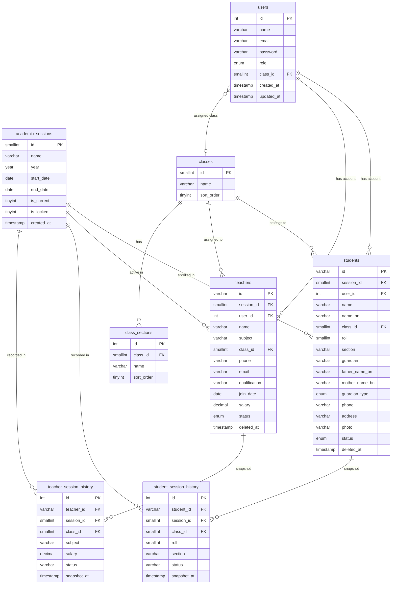

---

### ER Diagram — Finance

Fee management, salary, transactions, and receipts.

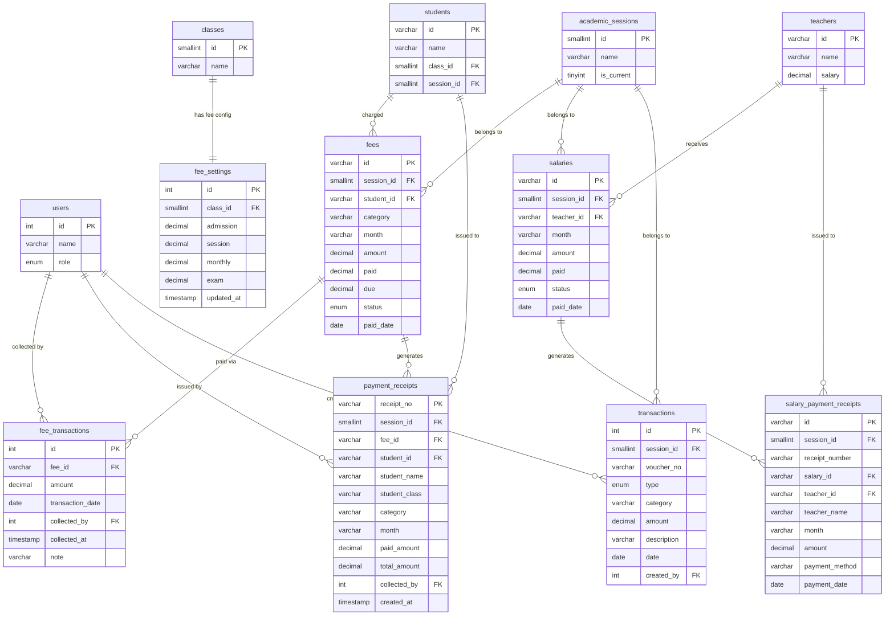

---

### ER Diagram — Academic

Exams, results, attendance, subjects, routines, and promotions.

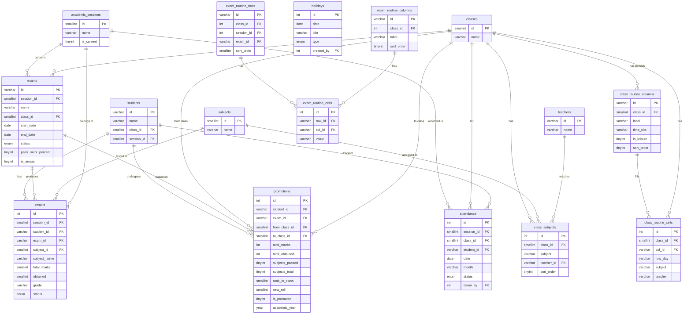

---

### ER Diagram — Website & Content

Public-facing content tables.

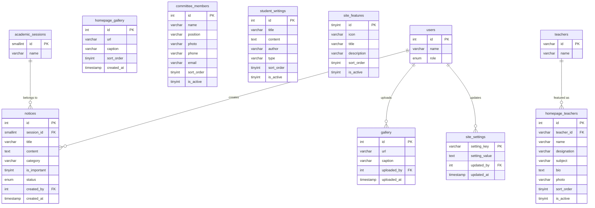

---

### Data Flow — User Authentication

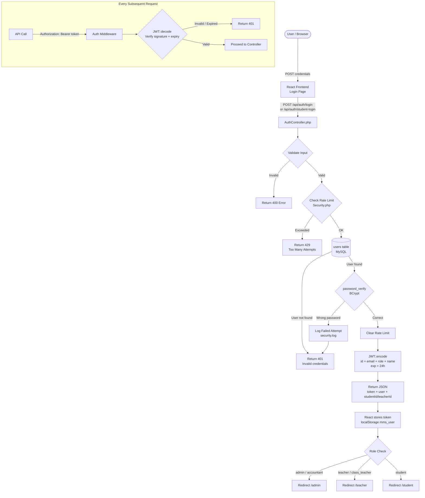

---

### Data Flow — Fee Collection

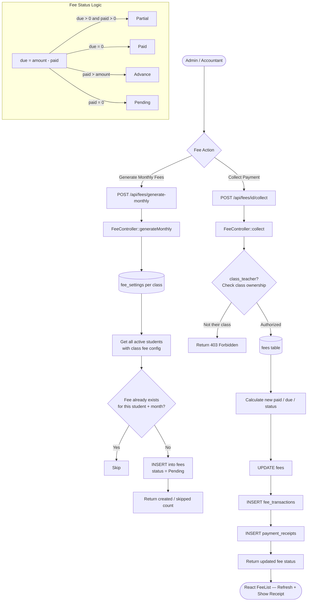

---

### Data Flow — Exam & Results

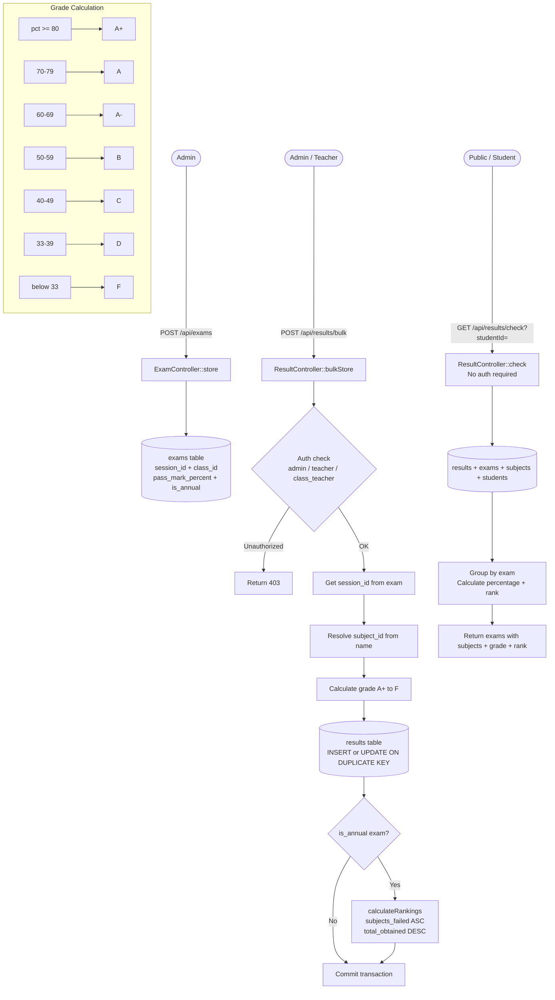

---

### Data Flow — Student Promotion

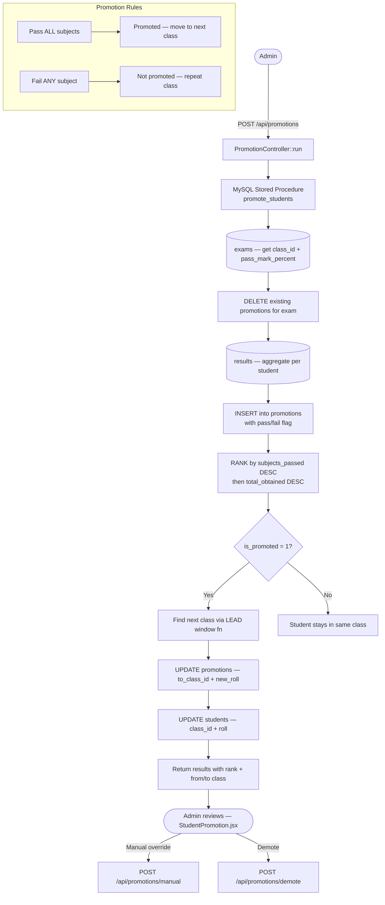

---

### Data Flow — Attendance

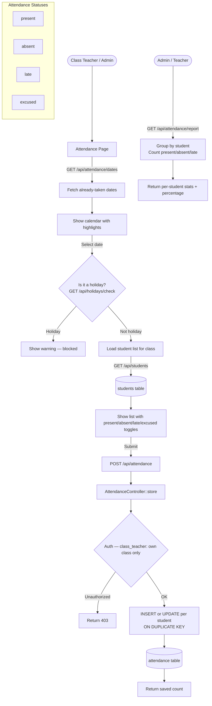

---

### System Architecture Overview

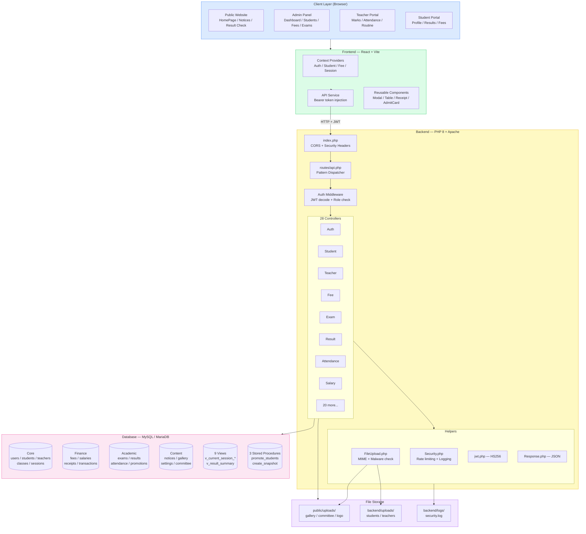

---

### Key Relationships Summary

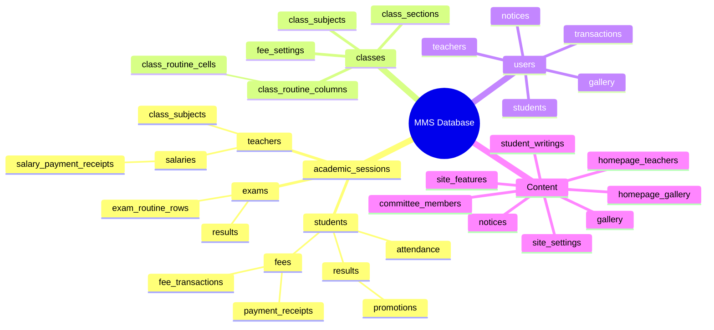

---

### Database Views Reference

| View | Description |
|---|---|
| `v_current_session_students` | Active students in the current session with class name |
| `v_current_session_teachers` | Active teachers in the current session |
| `v_current_session_exams` | Exams for the current session with class and session name |
| `v_current_session_fees` | Fees for the current session with student and class info |
| `v_current_session_results` | Results for the current session with student and exam name |
| `v_class_routine` | Full class timetable with period labels and time slots |
| `v_exam_routine` | Full exam timetable grid |
| `v_result_summary` | Per-student per-exam total marks, obtained, and percentage |
| `v_salary_status` | Teacher salary status with due amount |
| `v_student_fee_summary` | Per-student total fees, paid, and outstanding due |

---

### Stored Procedures Reference

| Procedure | Parameters | Description |
|---|---|---|
| `promote_students` | `exam_id`, `academic_year` | Calculates ranks, determines pass/fail, moves students to next class |
| `create_session_snapshot` | `session_id` | Snapshots all students and teachers for a session into history tables |
| `switch_current_session` | `new_session_id` | Snapshots old session then activates the new one |
| `get_session_statistics` | `session_id` | Returns aggregate counts for students, teachers, fees, exams, results |

---

## Troubleshooting

### CORS errors in browser

**Symptom:** `Access-Control-Allow-Origin` errors in the console.

**Fix:** Make sure `VITE_API_URL` in `.env` matches exactly where your backend is served. Restart the dev server after changing `.env`.

```env
VITE_API_URL=http://localhost/madrasah/backend
```

---

### 404 on API routes

**Symptom:** All API calls return 404.

**Fix:** Make sure Apache `mod_rewrite` is enabled and `AllowOverride All` is set for your directory.

In XAMPP, open `httpd.conf` and find:
```apache
<Directory "C:/xampp/htdocs">
    AllowOverride All   ← make sure this is "All", not "None"
</Directory>
```

Also enable the module:
```apache
LoadModule rewrite_module modules/mod_rewrite.so  ← uncomment this line
```

Restart Apache after changes.

---

### Database connection failed

**Symptom:** API returns `Database connection failed`.

**Fix:** Verify your credentials in `.env` match your MySQL setup. Default XAMPP credentials are `root` with no password.

---

### File uploads not working

**Symptom:** Photos don't upload or show broken images.

**Fix 1:** Check that `public/uploads/` and `backend/uploads/` directories exist and are writable.

**Fix 2:** Verify `APP_BASE_URL` is auto-detected correctly. You can override it in `.env`:
```env
APP_BASE_URL=http://localhost/madrasah
```

---

### Login blocked after failed attempts

**Symptom:** Getting "Too many login attempts" error.

**Fix:** Wait 15 minutes, or delete the rate limit cache files from the system temp directory. You can also adjust limits in `.env`:
```env
MAX_LOGIN_ATTEMPTS=10
LOGIN_LOCKOUT_TIME=300
```

---

### Blank page after build

**Symptom:** Production build shows a blank page.

**Fix:** Make sure `base` in `vite.config.js` matches your deployment path. If deploying to a subdirectory, update:
```js
// vite.config.js
export default defineConfig({
  base: '/madrasah/',  // match your subdirectory
})
```

---

## License

This project is for educational and institutional use. All rights reserved.

---

## Contributing

1. Fork the repository
2. Create a feature branch: `git checkout -b feature/your-feature`
3. Commit your changes: `git commit -m 'Add your feature'`
4. Push to the branch: `git push origin feature/your-feature`
5. Open a Pull Request

---

## Support

For issues or questions, open a GitHub issue or contact the maintainer.
